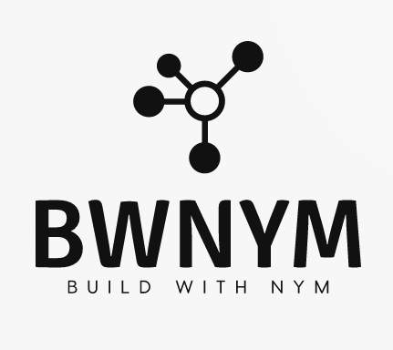

 

# BWNym
Proyect Shipyard Visionary Track for Nym Tech.   

[Squad Name]

BWNym

BWNym means Build with NYM. We want to help connect developers with NYM Tech. We are a Shipyard squad for Visionary track

[Manifiesto]

BWNym means Build with NYM. We want to help connect developers with NYM and help build privacy into the products we use (improve) or are being created.
It is important that developers who speak English or Spanish have at their disposal all the material they need in addition to having a community that shares their same concerns.
Our goal is to increase products that use NYM and helping to spread and practice privacy.

[Areas of Interest]

Development 
Translations
Technical content
Devs events/meetups
Workshops / Hackathons
Newbies support

[Squads Operations]

1. Connect with developers who want to implement privacy in their projects.
2. Create and maintain an updated list of resources that are necessary to implement NYM in a product.
3. Produce tutorials in english and spanish for a better understanding of the different SDKs and resources that NYM has for developers. 
4. Document experiences of developers who have already integrated NYM into their projects. 
5. Coordinate meetups with the NYM Build team and between developers to strengthen the NYM builder community.
6. Test developers' skills by supporting existing hackathons.
7. Give support newers.

[Milestones and deliverables]

Start: December 2023
Ends: December 2024.

Milestones:

* Minimum 10 new apps with Nym mini.
* 2 hackathons
* 4 meetups
* At least 2 tutorials for each sdk.

[Meet squad team]

Team member 1:

Skills: Software Engineer with +7 years of experience, Python, JS, Solidity, Data Analysis, GIS, Web3 and Privacy enthusiast.

X: @RocioGonzalezT9

Team Member 2:

Skills: Automotive Engineer, Math, CAD software, Bitcoin, Monero, Web3, privacy, Information Search.

X: @Gelois_0

[Contacts]

Telegram Group: https://t.me/+7vyW9UCJ7J42MWU5

Twitter: https://twitter.com/bwnym01

Email: bwnym@proton.me

Presentation doc: 

https://docs.google.com/presentation/d/1grvc1yB-gqIZY-ILgggZH4idIlvu_oShXtnTEDoUu3I/edit?usp=sharing

